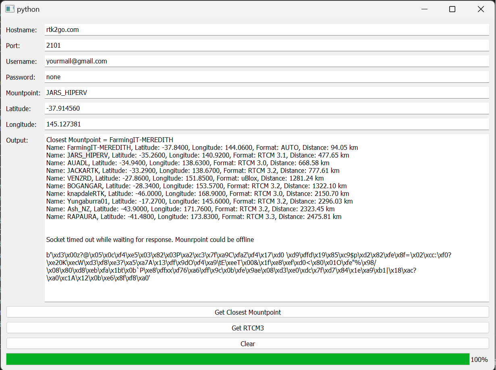

# Installation
Install the required dependencies:
```
pip install -r requirements.txt
```
# Usage
To run the GUI program, simply run
```
python NtripClientGUI.py.
```


# Contributing
Contributions are welcome! If you find a bug or would like to suggest a new feature, please open an issue or submit a pull request.

# License
This project is licensed under the GPL-3.0 license - see the LICENSE file for details
 
